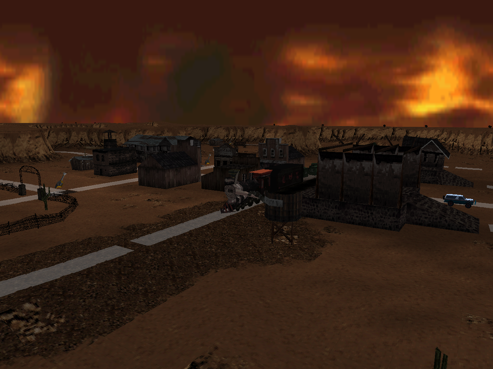
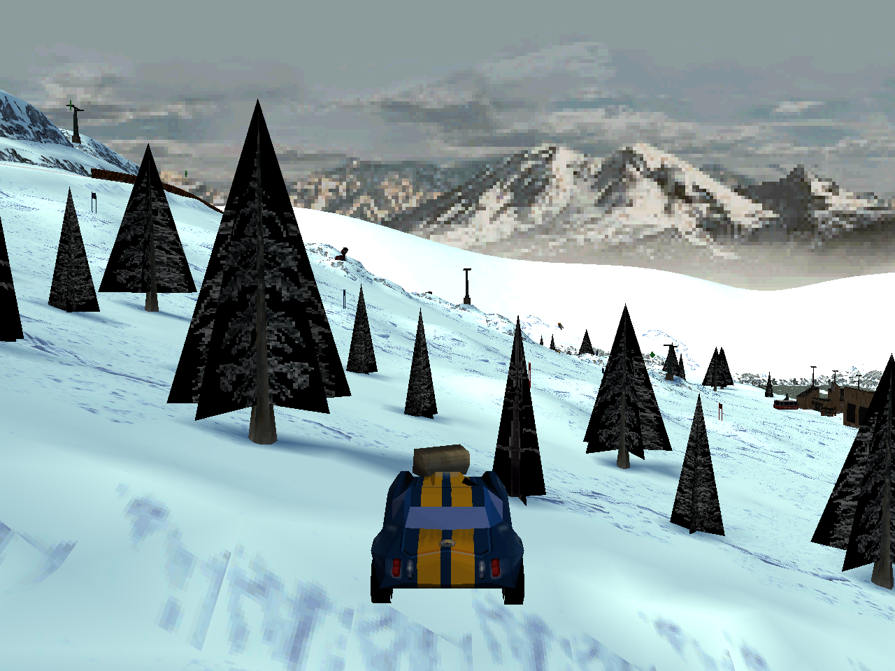

# Vigilante 8 PS1 Recompilation

This repository is a parked work-in-progress reverse engineering and runtime port of the PlayStation 1 version of **Vigilante 8**.

The project goal was to recover the original game behavior and proprietary asset formats closely enough to rebuild the runtime around rewritten renderer, input, and audio layers. The effort made real progress, but the project is currently paused rather than continuing to churn through unstable visual and gameplay regressions.

## Current Status

`main` is intentionally kept at the last good committed runtime baseline, with only this README and progress screenshots added on top. At the time of parking, that code baseline was:

```text
ff0464a Add WILDWEST train runtime movement
```

The abandoned unstable work is preserved separately on:

```text
codex/parked-wip-20260611
```

That branch contains selected investigation artifacts and an archived dirty patch, but it is not considered a good runtime branch.

## Visual Progress

WILDWEST terrain, props, and scripted train work:



SKIRESORT terrain and pickup visual investigation:



## What Was Working Best

- Original PS1 level assets load directly from extracted game data.
- Several proprietary level/terrain structures were decoded enough to render recognizable maps.
- WILDWEST terrain blending, train tracks, collision primitives, and moving train behavior reached a useful vertical-slice baseline.
- Real PS1 sound sample playback was partially wired, including vehicle engine audio.
- Emulator trace tooling and runtime debug logging exist for future verification passes.

## Known Parked Problems

The final active work moved into a bad regression state. Known unresolved problems include:

- Weapon pickup visuals and attached weapon models have missing or malformed polygons.
- Some pickups attach at incorrect offsets or fail to play the correct attachment lifecycle.
- Seeker/attached weapon behavior regressed from an earlier working state.
- Pickup population/type selection still needs a source-exact pass.
- Alpha blending and visual ordering regressed during later experiments.
- Some controls, AI spawning, and character/vehicle handling had recently regressed.
- Several levels still need lighting, terrain, and scripted-object passes.

## Repository Notes

Important project documents:

- `AGENTS.md` - operating charter for the decompilation effort.
- `PROJECT_SCOPE.md` - 1:1 behavior requirements and seam contract.
- `DECOMP_RULES.md` - naming, confidence, and struct recovery rules.
- `progress.log` and `decisions.log` - historical work log and implementation rationale.
- `notes/` - reverse engineering notes and format documentation.
- `tools/` - extraction, trace, and verification helpers.

Generated build directories, transient logs, emulator traces, and local extracted game data are intentionally not part of the parked `main` branch.

## RecompOne Reference Lane

The `codex/recompone-reference-staging` branch includes a self-contained,
vendored RecompOne reference lane. It is intended to execute and trace original
gameplay, physics, HUD, and menu behavior while this repository remains the
shipping native C implementation. See `reference/README.md`; no game assets are
included.

## Restart Guidance

When this project is picked up again, start from `main`, not from the parked WIP branch. Treat the WIP branch as a research archive only.

The most productive next pass would likely be:

1. Re-establish a clean visual/runtime baseline.
2. Add tight runtime debug logging around pickup population, pickup draw, weapon attachment, and projectile firing.
3. Trace the original executable/emulator for those exact systems before writing replacement code.
4. Bring one level and one vehicle back to source-exact behavior before broadening again.
