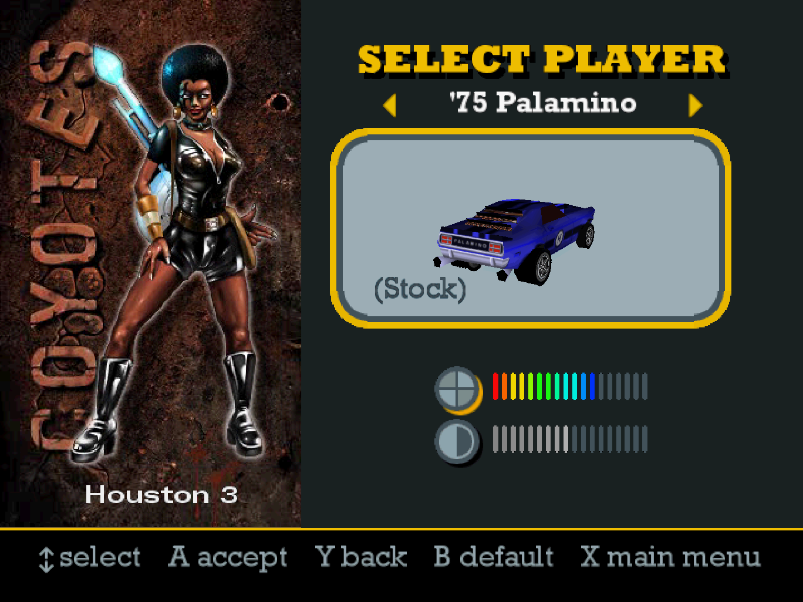
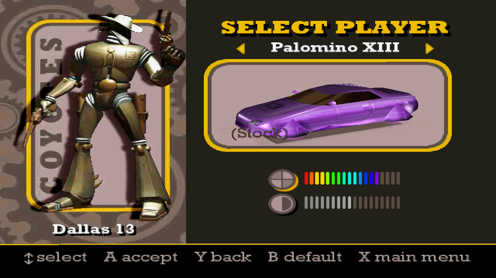

# Vigilante 8/2nd Offense PC Recompilation - Vigilante 8 Classic

An unofficial PC recompilation project for the PlayStation versions of
**Vigilante 8** and **Vigilante 8: 2nd Offense**. It's a two-in-one game!

## Gameplay Preview

[](https://www.youtube.com/watch?v=3hc6it7qC9M)

**[Watch on YouTube](https://www.youtube.com/watch?v=3hc6it7qC9M)** — Work in progress — test footage.

## Screenshots


<table>
  <tr>
    <td width="50%" align="center">
      
      <br>Location selection
    </td>
    <td width="50%" align="center">
      
      <br>Route 66 with enhanced textures
    </td>
  </tr>
  <tr>
    <td width="50%" align="center">
      
      <br>Original V8 Houston — custom blue paint
    </td>
    <td width="50%" align="center">
      
      <br>Dallas — custom purple paint
    </td>
  </tr>
</table>

## Building

Development requires the .NET 10 SDK, Python 3, and legally obtained game
inputs. Recompilation preparation generates local source from the retail
binaries before the host can be built; those generated sources are not stored
in Git.

Start with the game-specific documentation:

- [Vigilante 8 reference lane](reference/README.md)
- [Vigilante 8: 2nd Offense reference lane](reference-v8-2/README.md)
- [V8:2 loose-file layout](reference-v8-2/LOOSE_FILES.md)

After the V8:2 reference sources have been prepared locally, the development
host builds with:

```powershell
dotnet build tools/recompone-v8-2/reference-host/Vigilante82PC.csproj -c Debug
```

## Testing and Reports

Automated runs cover startup, selectors, gameplay entry, weapons, AI, movies,
split-screen, result flow, teardown, and bounded multi-arena soaks. Visual
changes are reviewed from retained original-resolution and presentation
captures in addition to logs and deterministic acceptance data.

When reporting a defect, include the executable build identifier from
`v8_latest.log`, the affected game mode/map/vehicle, reproduction steps, and
the log itself when possible.

## Legal

The release omits disc images and the complete base-game installation. Supply
the base-game data from your own copy. Included runtime mods and their media
dependencies are described in the release manifest; ownership of game and mod
content remains with the respective rights holders.

Vigilante 8 and Vigilante 8: 2nd Offense are properties of their respective
rights holders. This fan project is not affiliated with or endorsed by
Luxoflux, Activision, or the rights holders.
