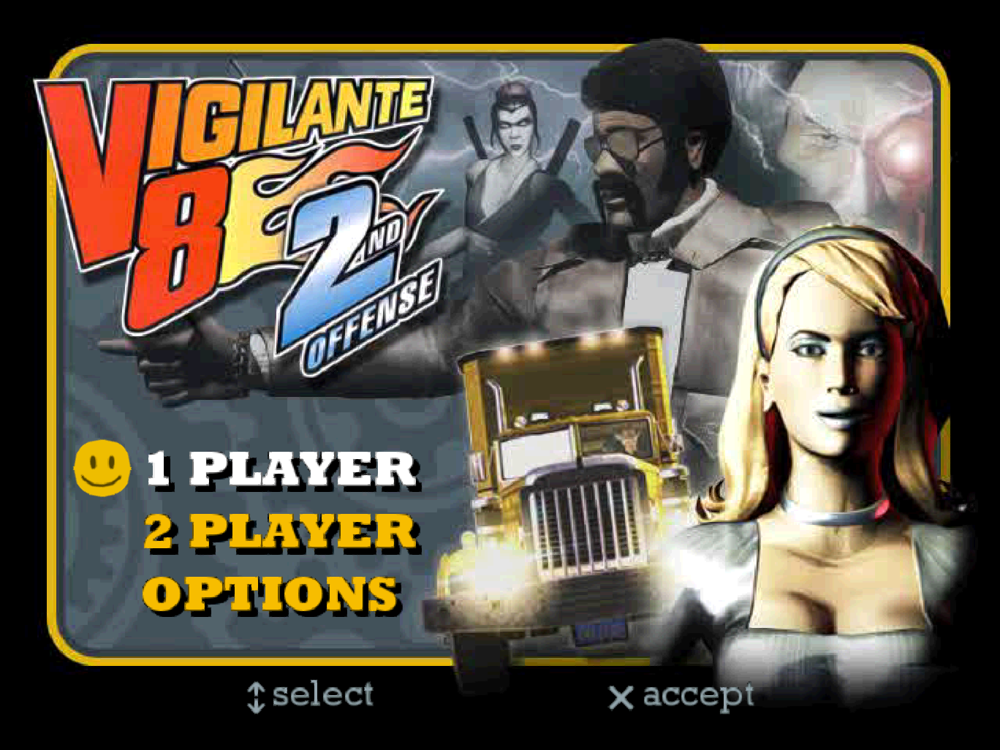
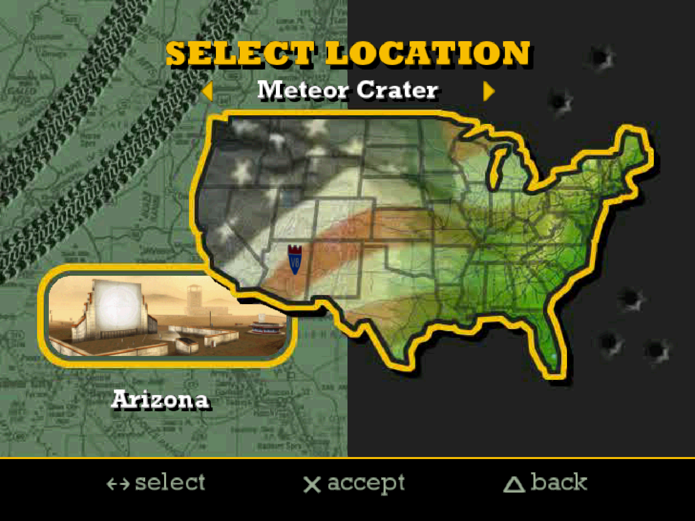
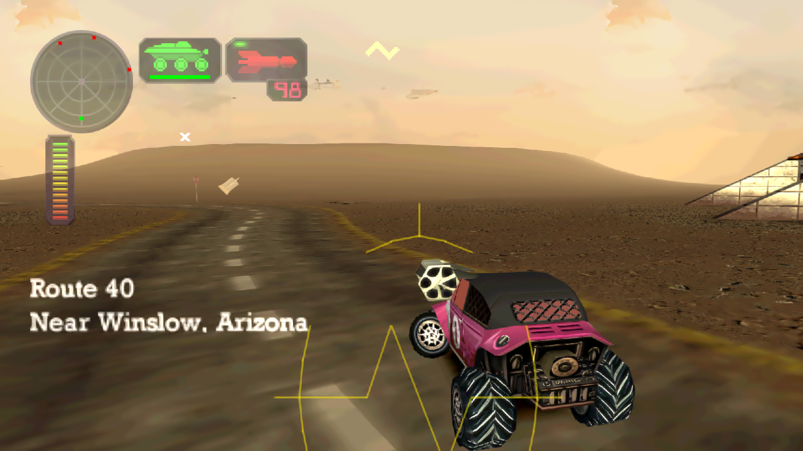

# Vigilante 8 PC Recompilation

An unofficial PC recompilation project for the PlayStation versions of
**Vigilante 8** and **Vigilante 8: 2nd Offense**.

The project runs recompiled original game code inside a modern Windows host
while replacing the PlayStation-facing renderer, input, audio, media, and file
access layers. The goal is to preserve the games' behavior while making them
comfortable to play, test, and extend on current hardware.

> [!IMPORTANT]
> This project is in pre-release testing. Vigilante 8: 2nd Offense is the
> current release-candidate focus; the original Vigilante 8 build and native C
> decompilation remain active development work. No copyrighted game data is
> included.

## Screenshots







## Current Status

| Game | State | Current scope |
| --- | --- | --- |
| Vigilante 8: 2nd Offense | Windows x64 release candidate | USA `SLUS-00868`, one- and two-player play, first-run disc import, enhanced presentation, and mods |
| Vigilante 8 | Playable development/reference build | All retail arenas, direct disc or complete loose-file play, one- and two-player testing, and long-form stability coverage |
| Native C decompilation | Ongoing | Physics, collision, gameplay, and proprietary asset loaders; renderer, controls, and audio are intentionally rewritten |

The V8:2 candidate has passed fresh-directory first-run installation, repeat
launch, Route 66 gameplay, and invalid-disc rejection smoke tests. Broader
release regression work is still in progress.

## Highlights

- Original PS1 game logic recompiled for a native 64-bit Windows host.
- Widescreen and selectable output resolution, with high-resolution 3D
  presentation and optional anti-aliasing.
- Enhanced shadows, lighting, fog, particles, texture filtering, mipmaps, and
  extended draw distance.
- High-resolution texture replacement and vectorized interface support.
- In-game video and control settings, including Modern, Trigger Drive,
  Classic, and Southpaw controller profiles.
- Movies, voices, sound effects, save data, and CD-audio playback.
- Standalone loose-file operation after the original disc has been imported.
- Mod loading from a distributable `mods` directory.
- A bundled V8:2 guest-roster mod containing all twelve original Vigilante 8
  vehicles, with player and AI support.
- Original Vigilante 8 arena compatibility work inside the V8:2 runtime.

## V8:2 Quick Start

### Requirements

- 64-bit Windows.
- An OpenGL 4.5-capable graphics driver.
- A legally obtained USA Vigilante 8: 2nd Offense disc image matching
  `SLUS-00868`, or a complete loose extraction from that disc.

### Install from BIN/CUE

1. Extract the release archive to a new folder.
2. Place the `.cue` file and every `.bin` file it references beside
   `Vigilante82PC.exe`.
3. Keep the included `mods` directory beside the executable.
4. Run `Vigilante82PC.exe`.

On first run, the game automatically finds an adjacent CUE, validates the
supported disc layout and critical files, extracts all 128 game-data files to
`game_data`, and converts CD-audio tracks 2-17 to 44.1 kHz stereo OGG files.
Later launches use the imported files and no longer read the disc image.

There is no graphical disc browser in the current candidate. To import a CUE
stored elsewhere, pass its path on the command line:

```powershell
Vigilante82PC.exe "D:\Games\Vigilante 8 2nd Offense\game.cue"
```

An interrupted import is left in `game_data.partial` and is never accepted as
a playable installation. Launch the game again to retry the import.

### Install from Loose Files

A complete loose extraction is also supported. Its root must contain
`SYSTEM.CNF`, `SLUS_008.68`, and every original game folder and file. Place
`Vigilante82PC.exe` and the included `mods` directory in that root, then run
the executable. Partial copies of selected stock data folders are not valid
installations.

### Runtime Dependencies

The release executable is self-contained. It bundles the .NET runtime, SDL2,
GLFW, cimgui, the Microsoft Visual C++ runtime, and the OGG encoder used by the
first-run importer. Players do not need to install .NET, Visual C++
redistributables, Python, or ffmpeg, and no app-local DLL files are required.

The game creates local settings, save, and diagnostic files as needed. These
are not part of the release archive.

## Disc Compatibility

The importer currently accepts the USA `SLUS-00868` release used for the
recompilation. It checks the 17-track layout and SHA-256 identities of the
original executable and critical shell data before writing `game_data`.
Different regions, revisions, incomplete dumps, and modified critical files
are rejected early instead of producing a subtly broken installation.

The release archive contains the executable, its README, and distributable
mods only. It does not contain stock game data.

## Mods

Mods are isolated under `mods/<mod-name>/` and can supply manifests, textures,
vehicles, arenas, and other replacement content without overwriting imported
stock data. Keep the directory structure intact when moving an installation.

The bundled original-V8 guest roster is part of the current V8:2 candidate.
**Super Dreamland 64**, the experimental N64 arena port, remains a work in
progress rather than a finished release feature. Vehicle glass can disappear
at some view angles, and terrain/distance lighting bands remain visible. Those
issues are open and the level should be treated accordingly.

## Known Limitations

- Full release-candidate regression signoff is not complete.
- Super Dreamland 64 still has unresolved vehicle-glass and distant-terrain
  rendering defects.
- Four-player local play is deferred until after the initial release; current
  release scope is one or two players.
- Default music balance still needs final tuning.
- The first-run importer has no graphical file picker.
- Only the exact supported USA V8:2 disc revision is accepted automatically.

The canonical, detailed backlog is maintained in [TO-DO.MD](TO-DO.MD).

## Project Structure

This repository contains two complementary efforts: a playable RecompOne PC
runtime and a long-term clean C decompilation.

| Path | Purpose |
| --- | --- |
| `tools/recompone-reference/` | Shared PS1 runtime, host services, renderer, audio, input, and automation |
| `tools/recompone-v8/` | Original Vigilante 8 preparation and game-specific integration |
| `tools/recompone-v8-2/` | V8:2 preparation, host, patches, importer, and test tooling |
| `reference/` | Original Vigilante 8 reference-lane documentation and generated-work area |
| `reference-v8-2/` | V8:2 manifests, documentation, and generated-work area |
| `src/`, `include/`, `analysis/` | Native C decompilation, recovered types, and reverse-engineering output |
| `mods/` | Mod manifests and distributable mod content |
| `notes/` | Format research, defect investigations, and verification records |

Retail executables, extracted game assets, generated recompilation output,
local saves, logs, and release staging directories are intentionally excluded
from version control.

## Building

Development requires the .NET 10 SDK, Python 3, and legally obtained game
inputs. Recompilation preparation generates local source from the retail
binaries before the host can be built; those generated sources are not stored
in Git.

Start with the game-specific documentation:

- [Vigilante 8 reference lane](reference/README.md)
- [Vigilante 8: 2nd Offense reference lane](reference-v8-2/README.md)
- [V8:2 loose-file layout](reference-v8-2/LOOSE_FILES.md)
- [Project scope](PROJECT_SCOPE.md)
- [Decompilation rules](DECOMP_RULES.md)

After the V8:2 reference sources have been prepared locally, the development
host builds with:

```powershell
dotnet build tools/recompone-v8-2/reference-host/Vigilante82PC.csproj -c Debug
```

## Testing and Reports

Automated runs cover startup, selectors, gameplay entry, weapons, AI, movies,
split-screen, result flow, teardown, and bounded multi-arena soaks. Visual
changes are reviewed from retained native and presentation captures in addition
to logs and deterministic acceptance data.

When reporting a defect, include the executable build identifier from
`v8_latest.log`, the affected game mode/map/vehicle, reproduction steps, and
the log itself when possible.

## Legal

This repository does not distribute Vigilante 8 or Vigilante 8: 2nd Offense
disc images, executables, music, movies, or other copyrighted retail assets.
You must supply game data from a copy you legally own.

Vigilante 8 and Vigilante 8: 2nd Offense are properties of their respective
rights holders. This fan project is not affiliated with or endorsed by
Luxoflux, Activision, or the rights holders.
